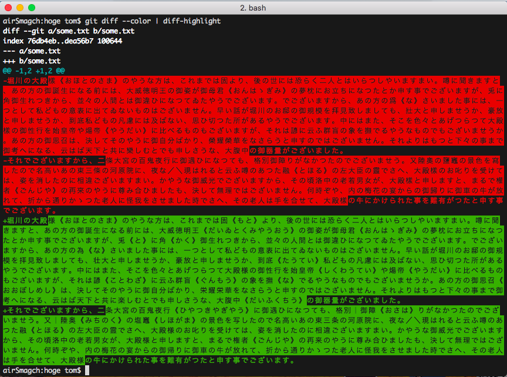
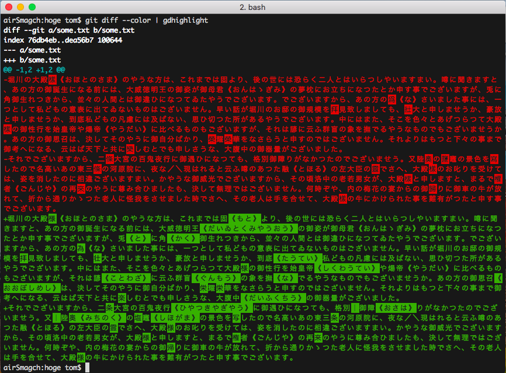

# Git Diff Highlight

**Git Diff Highlight** is a command line tool in order for Git to highlight by
character.

There are already great highlighters for Git such as [diff-highlight]. But it's
sometimes hard to see differences when your text contains long paragraphs
without line break. In such a case, highlighted areas are covered almost all of
paragraph, so you can hardly discover differences in them:



With **Git Diff Highlight**, however, it shows every detail of differences
because highlights are oriented by character:



So, as you can see from the above images, **Git Diff Highlight** is meant not
for programmers but for writers, who write in CKJ languages — Chinese, Korean,
and Japanese — and who don't follow programmer's aesthetic convention (80
characters line break rule.)

## Installation

`gdhighlight` command is available.

```
$ go install github.com/smagch/git-diff-highlight/gdhighlight
```

## Usage

```
$ git diff --color | gdhighlight
```

## Testing

```
$ go test
```

## TODO

- add Color Config as [diff-highlight] do.
- avoid `panic()`.
- GitHub Release to distribute binary, if some people find this package useful.

[diff-highlight]: https://github.com/git/git/tree/master/contrib/diff-highlight
